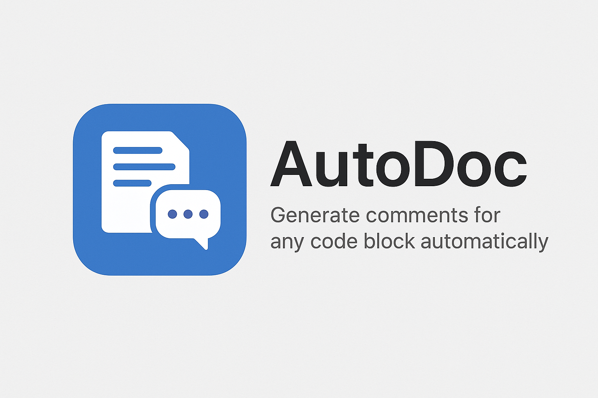
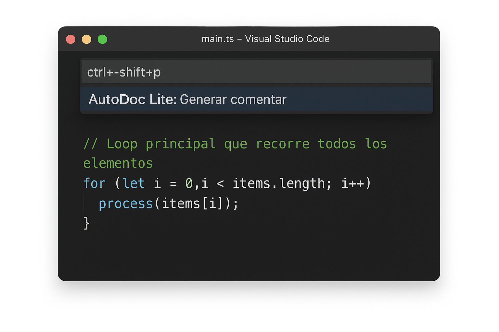

# AutoDoc-Lite: Comentarios Inteligentes para VS Code



**AutoDoc-Lite** es una extensión para Visual Studio Code diseñada para acelerar tu flujo de trabajo de documentación. Genera comentarios de forma automática e inteligente para múltiples lenguajes de programación, permitiéndote enfocarte en lo que realmente importa: el código.



---

## ✨ Características Principales

- **Detección Automática de Lenguaje**: Identifica automáticamente JavaScript, TypeScript, Python, Java y C#, aplicando el estilo de comentario correcto (`//` o `#`).
- **Generación con un Clic**: Coloca el cursor sobre una función y presiona un atajo para generar un comentario base.
- **Vista Previa Interactiva**: Antes de insertar cualquier comentario, te muestra una vista previa para que puedas aceptarlo o cancelarlo.
- **Atajo de Teclado Intuitivo**: Usa `Ctrl+Alt+D` (`Cmd+Alt+D` en macOS) para generar comentarios al instante.
- **Altamente Configurable**: Personaliza los comentarios a tu gusto, desde el estilo hasta el contenido, a través del panel de configuración de VS Code.

---

## 🚀 Instalación

1. Abre **Visual Studio Code**.
2. Ve a la vista de **Extensiones** (`Ctrl+Shift+X`).
3. Busca `AutoDoc-Lite`.
4. Haz clic en **Instalar**.

---

## 💡 Cómo Usar

1. Abre un archivo de un lenguaje compatible (JS, TS, Py, Java, C#).
2. Coloca el cursor dentro de la línea de una función o método que desees documentar.
3. Presiona `Ctrl+Alt+D`.
4. Aparecerá una notificación de vista previa con el comentario sugerido.
5. Haz clic en **Aceptar** para insertar el comentario encima de la función.

**Ejemplo de comentario generado en TypeScript:**
```typescript
// TODO: Explica esta función y sus parámetros
function add(a: number, b: number): number {
    return a + b;
}
```

**Ejemplo de comentario generado en Python:**
```python
# TODO: Explica esta función y sus parámetros
def my_function(param1, param2):
    """This is a docstring."""
    return param1 + param2
```

---

## ⚙️ Configuración

Puedes personalizar el comportamiento de la extensión desde la configuración de VS Code (`Ctrl+,`). Busca "AutoDoc-Lite" para encontrar las siguientes opciones:

- **`autodoc-lite.commentStyle`**: Elige el estilo del comentario a generar.
  - **Valores**: `JSDoc`, `DocString`, `Simple` (Próximamente).
  - **Default**: `JSDoc`.

- **`autodoc-lite.detailLevel`**: Define qué tan detallado será el comentario.
  - **Valores**: `Resumen`, `Detallado` (Próximamente).
  - **Default**: `Resumen`.

- **`autodoc-lite.customTemplate`**: Define una plantilla personalizada para tus comentarios. Usa la variable `${code}` para insertar el bloque de código detectado (Próximamente).
  - **Default**: (Vacío).

---

Hecho con ❤️ por la comunidad de código abierto.